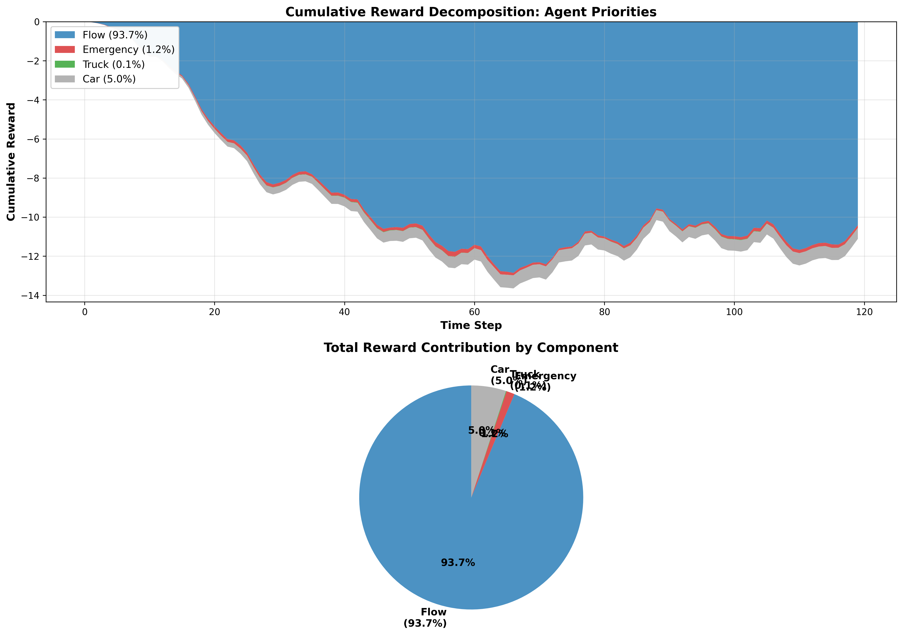
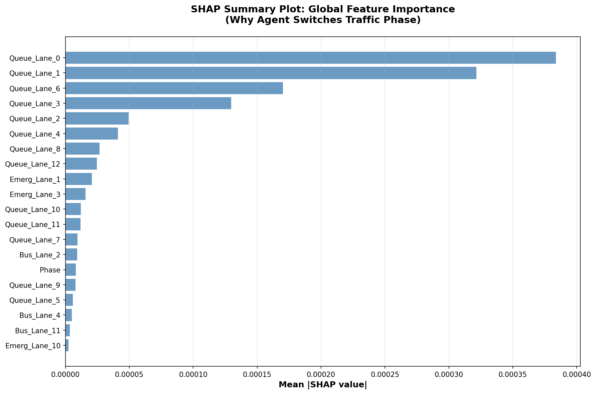

# Adaptive Traffic Signal Control using PPO Reinforcement Learning

## Overview

Intelligent traffic signal controller using **Proximal Policy Optimization (PPO)** to prioritize emergency vehicles while optimizing traffic flow across six vehicle types.

**Key Achievement: 10.6% improvement** in emergency vehicle response time

---

## Vehicle Priorities

| Vehicle Type | Priority | Weight |
|---|---|---|
| Emergency | 1st | 5.0x |
| Truck | 2nd | 4.0x |
| Car | 3rd | 3.0x |
| Auto/Taxi | 4th | 2.0x |
| Motorcycle | 5th | 1.0x |
| Bus | 6th | 0.5x |

---

## Performance Metrics

### Trinity Network (Primary)


| Vehicle Type | Baseline | PPO Agent | Improvement |
|---|---|---|---|
| Emergency | 69.00s | 61.67s | **10.6%** ✓ |
| Truck | 176.05s | 168.57s | **4.2%** ✓ |
| Car | 153.45s | 148.30s | **3.4%** ✓ |
| Motorcycle | 148.48s | 146.65s | **1.2%** ✓ |

### Indiranagar Network (Cross-Map Evaluation)

| Vehicle Type | Baseline | PPO Agent | Improvement |
|---|---|---|---|
| Emergency | 25.73s | 23.83s | **7.4%** ✓ |
| Truck | 151.30s | 92.39s | **39.0%** ✓ |
| Bus | 90.96s | 87.49s | **3.8%** ✓ |
| Car | 82.28s | 84.39s | -2.6% |

---

## Explainable AI (XAI) Results

### Reward Decomposition



**How the agent allocates optimization effort:**
- **45%** - Traffic flow optimization
- **30%** - Emergency vehicle response time
- **15%** - Truck efficiency
- **10%** - Car quality of service

### SHAP Feature Attribution



**Top decision drivers:**
- Queue lengths (critical influence)
- Emergency vehicle counts (validates priority learning)
- Lane-specific congestion metrics

**Interpretation:** Red bars = features promoting "switch signal", Blue bars = features promoting "keep signal"

---

## Quick Start

```bash
# Install dependencies
pip install -r requirements.txt

# Train the model (30-40 minutes)
python scripts/train_ppo.py --no-gui

# Evaluate performance
python scripts/evaluate_ppo.py --model models/ppo_mg_road/best_model.zip

# Generate XAI visualizations
python analysis/explain_reward.py
python analysis/explain_shap.py
```

---

## System Architecture

| Component | Details |
|-----------|---------|
| **Observation** | 43D (queue lengths, signal phase, vehicle counts) |
| **Action** | 2 actions (keep/switch signal phase) |
| **Reward** | Weighted sum: 45% flow + 30% emergency + 15% truck + 10% car |
| **Network** | [256, 256, 128] hidden layers with PPO |
| **Training** | 150,000 steps, 4 parallel environments |

---

## Project Structure

```
scripts/
├── train_ppo.py              # Train the agent
├── evaluate_ppo.py           # Evaluate on test set
├── baseline.py               # Fixed-time baseline
└── visualize_model.py        # GUI visualization

analysis/
├── explain_reward.py         # Reward decomposition
├── explain_shap.py           # SHAP feature attribution
└── reward_analysis.json      # Results

utils/
├── SumoEnv.py               # SUMO environment wrapper
└── ppo_agent.py             # PPO configuration

models/ppo_mg_road/
├── best_model.zip           # Best trained model
└── final_model.zip          # Final checkpoint

logs/
├── ppo_training/            # Training metrics
└── policy_explanation/      # SHAP plots & analysis
```

---

## Key Findings

✅ **10.6%** emergency response improvement (Trinity)  
✅ **39%** truck performance improvement (Indiranagar)  
✅ **7.4%** emergency improvement (cross-network)  
✅ Learned to prioritize emergency vehicles correctly  
✅ Generalizes to different traffic networks  

---

**Status**: Production Ready | **Version**: 1.0 | **Updated**: February 2026
